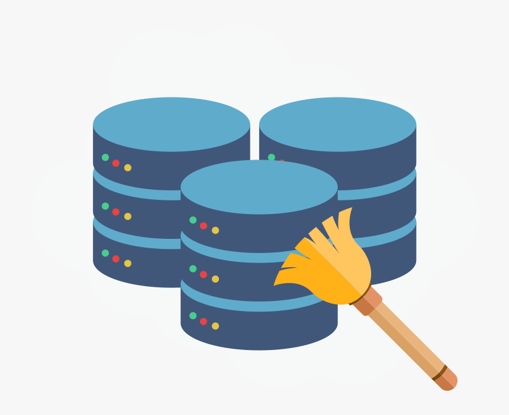

# data-cleaning-pandas
Are shark sexist and attack more females than male!?

The objective of this file is to clean a very convoluted raw data set with an astonishing amount of useless columns and rows that, after a deep cleaning, provides 6,000 rows of useful data that will be used to answer our hypothesis from the starting 27,000 rows.

# Readme structure:

1) Our goals and hypothesis regarding shark attacks.
2) Our data cleaning proccess.

## Goals

This repository has a very clear goals divided into 4 mini hypothesis:

1. Sharks fatal attacks are more recurrent on women than men.
2. Surfing related activities have the highest fatality ratio.
3. Shark attacks have a strong relationshi with the age of the those attacked.
4. There is at least one group of activities that provoke the sharks more than others.

Inside the **visualization** file you will be able to see the hypothesis results

## Data cleaning

### Raw data set

Source:Kaggle
Raw data set name: Global Shark Attacks
The raw data set that we used contains different encounters between humans and sharks that resulted in unfortunate attacks.

The cleaning of this data set was done in different steps that we will mention briefly, but they are shown in dept in the **cleaning_data** file.

Cleaning steps:

1. Import all libraries.
2. Change column names.
3. We dropped repeated and useless columns with no data (full of nan).
4. We cleaned the columns that will be used to validate our hypothesis.
5. We exported the clean data base.

The cleaned data that we used for the **visualization** file is the **tiburon_hipotesis.csv** file. 

## Tech stack 

-[numpy as np](https://numpy.org/doc/)

-[pandas as pd](https://pandas.pydata.org/docs/)

-[seaborn as sns](https://seaborn.pydata.org/introduction.html)

-[matplotlib.pyplot as plt](https://matplotlib.org/)

-[re](https://docs.python.org/3/library/re.html)

-[collections import Counter](https://docs.python.org/3/library/collections.html) 

-[operator import itemgetter](https://docs.python.org/3/library/operator.html)

## SRC Folder

Inside this folder you will be able to hace all the functions that we created in order to clean the data. Some are super cool so check it out!

Hope you enjoy the files :)
